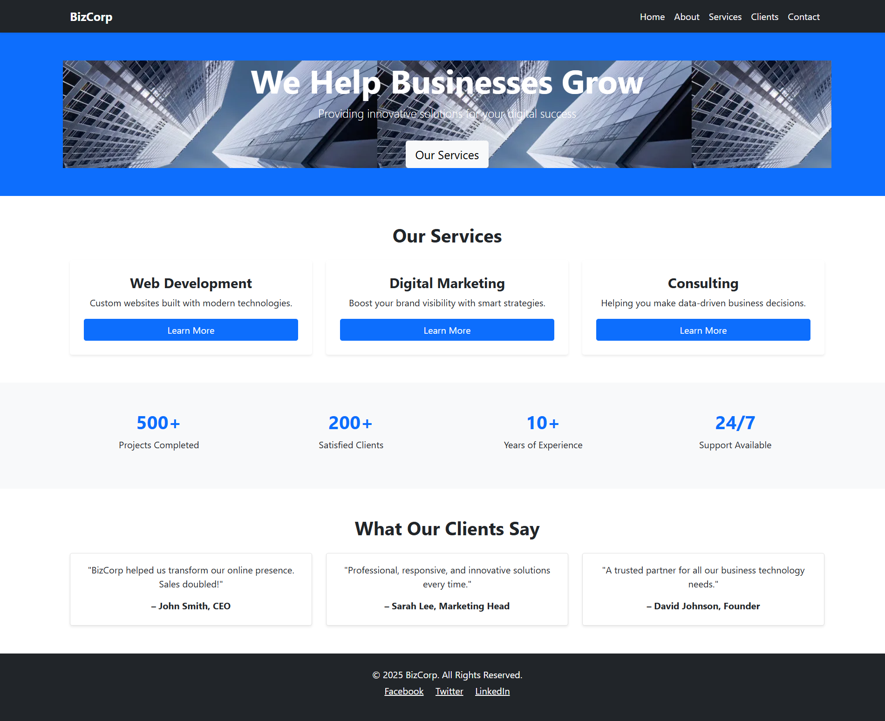
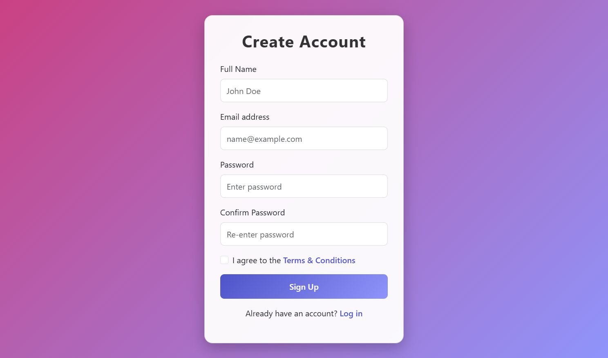

# 🎬 Bootstap outh homepages


🚀 A fully responsive and modern authentication UI built with HTML, CSS, JavaScript, and Bootstrap.  

## ✨ Highlights
- 🔑 Login & signup on a single page  
- 📱 Mobile-first responsive design  
- 🎨 Modern styles with hover effects  
- ✅ Client-side validation  
- 🔄 Animated transitions  

---

## 🧰 Tech Used
- HTML5  
- CSS3  
- JavaScript (ES6)  
- Bootstrap 5 
---

# 🔗 Links

1. GitHub Repository: [ Portfolio Repo](https://niranjandascp.github.io/Portfolio/)
---
## 📂 Installation & Setup

1. Clone the repository:
   ```bash
   git clone https://github.com/niranjandascp/bootstrap-outh-homepage.git
   cd netflix-clone
2. Open the folder in VS Code

3. Install Live Server extension

4. Right-click index.html → Open with Live Server

---
 
## 📸 **screenshot of website**

 

---
 

---

 

---